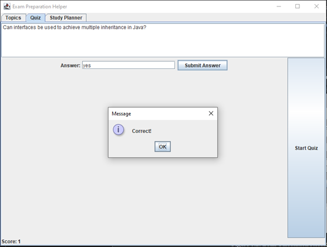
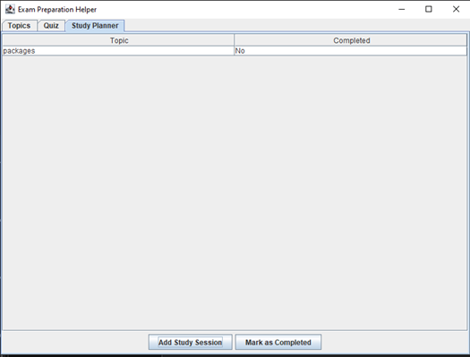

# Exam Preparation Helper (Java)

Exam Preparation Helper is a Java-based desktop GUI application developed as an academic learning project.  
It helps students manage exam topics, practice quiz questions, and track study progress through a simple and user-friendly interface.

---

## 📌 Project Overview
The application is designed to assist students in organizing their exam preparation by:
- Managing topics
- Practicing quiz questions
- Tracking completed and pending study topics

This project was created to practice Java programming concepts, GUI development, and event handling.

---

## 🧩 Features

### 1️⃣ Topics Module
- Add new exam topics
- Display the list of available topics
- Serves as the base for quizzes and study planning

### 2️⃣ Quiz Module
- Displays conceptual quiz questions
- Accepts user answers
- Validates answers and shows feedback using dialog boxes
- Maintains and displays quiz score

### 3️⃣ Study Planner Module
- Displays topics in a table format
- Tracks completion status (Yes / No)
- Allows marking topics as completed
- Helps monitor preparation progress

---

## 🖥 User Interface
- Java desktop GUI using AWT & Swing
- Tab-based navigation:
  - Topics
  - Quiz
  - Study Planner
- Dialog messages for feedback
- Simple and beginner-friendly layout

---

## 📷 Screenshots

### Topics Management

### Quiz Module

### Study Planner

---

## 🛠 Technologies Used
- Java
- AWT & Swing
- Event Handling
- Basic Data Structures

